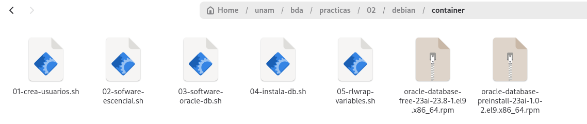

## Practica 2 BDA debian

## Scripts

Se crearon algunos scripts para realizar mas rápido la práctica. para usarlos

Copiar la carpeta **debian** a **/unam/bda/practicas/02/** 

## 1 Instalación de docker

No hace falta eliminar paquetes, porque debian viene sin docker

### Instalación de docker

Ejecutar los siguientes scripts basados en la documentación de docker para debian: [Install Docker Engine on Debian]([Install Docker Engine on Debian | Docker Docs](https://docs.docker.com/engine/install/debian/))

```shellsession
martin@pc-bda-mqr:~$ cd /unam/bda/practicas/02/debian
martin@pc-bda-mqr:~/bda/prac_02/debian$ sh 01_conf_repo_docker.sh 
martin@pc-bda-mqr:~/bda/prac_02/debian$ sh 02_install_docker_ce.sh 
```

habilitar el servicio de docker

```shellsession
martin@pc-bda-mqr:~/bda/prac_02/debian$ sudo systemctl start docker
martin@pc-bda-mqr:~/bda/prac_02/debian$ sudo systemctl status docker
```

Ejecutar el hola mundo de docker

```shellsession
martin@pc-bda-mqr:~/bda/prac_02/debian$  sudo docker run hello-world
Unable to find image 'hello-world:latest' locally
latest: Pulling from library/hello-world
4f55086f7dd0: Pull complete 
d5e71e642bf5: Download complete 
Digest: sha256:5e23090353324d887c48ad5e5c56d294eab81588df9605b07d1afe895f9cc8f8
Status: Downloaded newer image for hello-world:latest

Hello from Docker!
This message shows that your installation appears to be working correctly.
```

Esto significa que docker funciona de manera correcta

Agregar el usuario al **grupo docker** para ejecutar **docker** sin **sudo**

```bash
 sudo usermod -aG docker martin
```

# 2 Crear el contenedor

### Script para crear contenedor

Para un alumno **martin** que cursa **bda** el script debe quedar así

**/unam/bda/practicas/02/s-01-crea-contenedor-EDIT.sh**

```bash
#! /bin/bash
sudo docker run -i -t \
    -v $UNAM_HOME:$UNAM_HOME \
    --name c0-ol-mqr \
    --hostname h0-ol-mqr.fi.unam \
    --shm-size=2gb \
    -e DISPLAY=$DISPLAY container-registry.oracle.com/os/oraclelinux:9 bash
```

ejecutar el script

```shellsession
martin@pc-bda-mqr:~/bda/prac_02/debian$ sh s-01-crea-contenedor-EDIT.sh 
[sudo] password for martin: 
Unable to find image 'container-registry.oracle.com/os/oraclelinux:9' locally
9: Pulling from os/oraclelinux
96d6d3d27236: Pull complete 
Digest: sha256:5a5876c31b2c5ee4d77165ba0b51e767ecd59e04d54ccaa1288219049632dac3
Status: Downloaded newer image for container-registry.oracle.com/os/oraclelinux:9
```

verificar que podemos ver el contenido de **$UNAM_HOME** desde el contenedor

```shellsession
bash-5.1# ls /unam/  
bda
```

Perfécto

### Alias para ejecutar el contenedor

Modificar ~/.bashrc y agregar los siguientes alias

**~/.bashrc**

```bash
## alias de docker
alias docker-ol-base='docker container start c0-ol-mqr && docker container attach c0-ol-mqr'
alias docker-ol-base-t='docker container exec -it c0-ol-mqr bash'
## formato del profesor
alias dockerOlBase='docker container start c0-ol-mqr && docker container attach c0-ol-mqr'
alias dockerOlBaseT='docker container exec -it c0-ol-mqr bash'
```

# Trabajo en el contenedor

Los siguientes scrips se ejecutan en el contenedor

## Usuarios

GUID de usuarios y grupos diferentes entre contenedor y provocan un desastre de permiso. Es necesario homologarlos

obtener GUID de grupo y usuario del host

ejecutar en el host

```shellsession
martin@pc-bda-mqr:/unam/bda/practicas/02$ id
uid=1000(martin) gid=1000(martin) groups=1000(martin),24(cdrom),25(floppy),27(sudo),29(audio),30(dip),44(video),46(plugdev),100(users),101(netdev),102(scanner),108(bluetooth),110(lpadmin)
```

Colocar: UID, GUID y nombre de usuario en el script **/unam/bda/practicas/02/debian/container/01-crea-usuarios.sh**

y ejecutarlo desde el contenedor como root

```shellsession
bash-5.1# pwd
/unam/bda/practicas/02/debian/container
bash-5.1# sh 01-crea-usuarios.sh 
Recrear usuario del host en el contenedor...
groupadd: group 'martin' already exists
useradd: user 'martin' already exists
Crear usuarios y grupos de Oracle...
groupadd: group 'oinstall' already exists
groupadd: group 'dba' already exists
groupadd: group 'oper' already exists
groupadd: group 'backupdba' already exists
groupadd: group 'dgdba' already exists
groupadd: group 'kmdba' already exists
Agregar usuario oracle...
useradd: user 'oracle' already exists
Configurar directorios...
Configurar contraseña de root:
Changing password for user root.
New password: 
```

proporcionar las contraseñas para **root**, **oracle**: Paswword recomendado oracle y el **usuario administrador**  

### Instalar software escencial

Todavía como root en el contenedor ejecutar **/unam/bda/practicas/02/debian/container/02-sofware-escencial.sh**, para instalar **wget**, **sudo** y **vim**

```shellsession
bash-5.1# sh 02-sofware-escencial.sh 
Ejecución como root confirmada. Continando con el script...
[...]
```

#### Descargar software de la BD

Ejecutar el script **/unam/bda/practicas/02/debian/container/03-software-oracle-db.sh**

```shellsession
[martin@h0-ol-mqr container]$ sh 03-software-oracle-db.sh 
descargando el software de oracle DB en: /unam/bda/practicas/02/debian/container
[...]
```

esto descargará los RPM necesarios par ainstalar la DB de oracle



#### Instalar el Software de la BD

Ejecutar el script **/unam/bda/practicas/02/debian/container/04-instala-db.sh** 

```shellsession
[martin@h0-ol-mqr container]$ sh 04-instala-db.sh 
Variable correcta. Iniciando la instalación de Oracle...
instalando pquete preinstall
[...]
```

#### Configurar variales de entorno e idioma e instala rlwap

ejecutar el script **/unam/bda/practicas/02/debian/container/05-rlwrap-variables.sh**

```shellsession
[martin@h0-ol-mqr container]$ sh 05-rlwrap-variables.sh 
instalar rlwap desde el repositorio EPEL
Last metadata expiration check: 1:27:49 ago on Sun 20 Sep 2026 11:36:26 PM CST.
[...]
```

## Validar resultados

Salir del contenedor y volver a entrar para verificar los resultados con el validador

```shellsession
[martin@h0-ol-mqr container]$ exit
logout
bash-5.1# exit 
exit
martin@pc-bda-mqr:/unam/bda/practicas/02/debian/container$ dockerOlBase
c0-ol-mqr
bash-5.1# su -l martin 
Last login: Mon Sep 21 00:53:20 CST 2026 on pts/0
[martin@h0-ol-mqr ~]$ cd /unam/bda/practicas/02/
[martin@h0-ol-mqr 02]$ sh runval.sh 
```

El validador debería mostrar todos los checks en [ok]

```sh-session
[martin@h0-ol-mqr 02]$ sh runval.sh 
=====================================================================
      Validación de resultados 📋 (Tomar captura desde aquí)
=====================================================================
Fecha ............................. 2026-09-21 01:07:58
Usuario ........................... martin
Hostname .......................... h0-ol-mqr.fi.unam
Asignatura ........................ bda
Semestre .......................... 2027-1
Práctica .......................... 02
Sistema operativo ................. PRETTY_NAME="Oracle Linux Server 9.8"
Versión ............................ 9.8
Lenguaje ............................ en_US.UTF-8
=====================================================================


✅ [PASS] 01 - usuario diferente a root: Usuario que ejecuta el script: martin
✅ [PASS] 02 - sistema operativo (ol): Sistema operativo correcto: ol
✅ [PASS] 03 - versión del sistema operativo (9): Versión del sistema operativo correcta: 9.8
✅ [PASS] 04 - variable UNAM_HOME: Variable UNAM_HOME correcta: /unam
✅ [PASS] 05 - existencia del directorio /unam/bda: Directorio /unam/bda encontrado
✅ [PASS] 06 - dueño de la carpeta /unam/bda: Dueño de la carpeta /unam/bda correcto: martin
✅ [PASS] 07 - grupo de la carpeta /unam/bda: Grupo de la carpeta /unam/bda correcto: martin
✅ [PASS] 08 - permisos de la carpeta /unam/bda: Permisos correctos para /unam/bda: 755
✅ [PASS] 09 - idioma del contenedor: Lenguaje correcto: en_US.UTF-8
✅ [PASS] 10 - hostname del contenedor (prefijo h0): Inicio de hostname de contenedor correcto: h0
✅ [PASS] 11 - hostname del contenedor (s.o.): S.O. correcto en hostname: ol
✅ [PASS] 12 - dominio del hostname (inicio): Inicio de dominio correcto: fi
✅ [PASS] 13 - dominio del hostname (fin): Término de dominio correcto: unam
✅ [PASS] 14 - uso de un contenedor Docker: Uso de Docker correcto
✅ [PASS] 15 - comando rlwrap: Instalación de rlwrap correcta
✅ [PASS] 16 - directorio ORACLE_HOME: ORACLE_HOME correcto: /opt/oracle/product/23ai/dbhomeFree
✅ [PASS] 17 - permisos del binario oracle: Permisos correctos para el archivo oracle: -rwsr-s--x
✅ [PASS] 18 - tamaño del binario oracle: Tamaño correcto para el archivo oracle: 529090912
✅ [PASS] 19 - tamaño del binario lsnrctl: Tamaño correcto para el archivo lsnrctl: 177192
✅ [PASS] 20 - tamaño del binario sqlplus: Tamaño correcto para el archivo sqlplus: 41568

🏆 RESUMEN: 20/20 validaciones correctas
FVH: 3ef74e70132fb8ce5eacbcb01ff49cf27888ad1eaee3858cd7068dfa4ccc77ec
================== : Fin de captura : =======================


bash: line 415: genera_checksum_reverso: command not found
```

## Crear imagen

en el host ejecutar el script **/unam/bda/practicas/02/debian/06-crea-imagen.sh**

pra crear la imagen **ol-mqr:1.0**

```shellsession
martin@pc-bda-mqr:/unam/bda/practicas/02/debian/container$ sh  06-crea-imagen.sh 
crear imagen del contenedor
Creando la imagen ol-mqr:1.0 a partir de c0-ol-mqr...
sha256:e1a51ed4c1c48f089e882e662c1f3e54bb73bbf28d10f07b1d3af012df9c45b3
Imagen ol-mqr:1.0 creada exitosamente.
```

listar las imágenes

```shellsession
martin@pc-bda-mqr:/unam/bda/practicas/02$ docker image list --all
                                                                                                                                                                                               i Info →   U  In Use
IMAGE                                            ID             DISK USAGE   CONTENT SIZE   EXTRA
container-registry.oracle.com/os/oraclelinux:9   5a5876c31b2c        359MB         98.6MB    U   
hello-world:latest                               5e2309035332       25.9kB         9.49kB    U   
ol-mqr:1.0                                       e1a51ed4c1c4       7.29GB         2.31GB       
```
